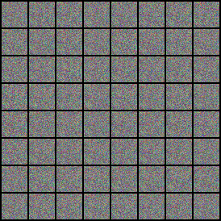
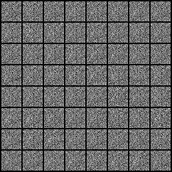

# GAN Implementation

## 1. Implementation of Generative Adversarial Networks (GANs)

This project implements a Generative Adversarial Network (GAN) based on the architecture proposed in the foundational GAN paper by **Goodfellow et al.** The GAN framework consists of two neural networks, a **generator** and a **discriminator**, which are trained together in a game-theoretic scenario. The generator creates fake data, while the discriminator tries to distinguish between real and fake data. The goal is to train the generator to produce data indistinguishable from real data, thereby improving the quality of generated samples over time.

---

## 2. General Overview of the Project

This implementation is structured into key modules to ensure clarity and maintainability:

- **Data**: Handles the loading and preprocessing of datasets (e.g., CIFAR-10, MNIST).
- **Models**: Contains the architecture definitions for both the **generator** and **discriminator** networks.
- **Utils**: Includes various utility functions for training, saving, and generating sample images and gifs.
- **Generated_Gif_Grids**: Stores the results from the GAN training, including gifs and image grids of generated samples.
- **GanTrainer**: The core class that trains the GAN model, manages the adversarial training process.
- **test.py**: Contains the main function for testing the trained GAN model and generating final results.
---

## 3. Project Structure

The project is organized as follows:

```
GAN_pytorch/
├───data                     # Dataset directory
├───generated_gif_grids      # Generated results (GIFs and image grids)
│   ├───CIFAR10              # Results for CIFAR-10
│   ├───MNIST                # Results for MNIST
├───models                   # Generator and Discriminator architectures
├───utils                    # Utility functions (training, image generation, etc.)
├───GanTrainer.py            # File containing the class that manages the training of the model
├───test.py                  # File for testing the model
```

---

## 4. Results

### Generated Images from CIFAR-10 and MNIST

Below are some examples showcasing the output of the GAN during and after training on the CIFAR-10 and MNIST datasets.

#### CIFAR-10 Example:

A GIF showing the evolution of the model over 200 epochs of training on the CIFAR10 dataset:

|  |
|------------------------------------------------------------|

#### MNIST Example:

A GIF showing the evolution of the model over 200 epochs of training on the MNIST dataset:

|  |
|-----------------------------------------------------------------|

---

## References

- Goodfellow, I., Pouget-Abadie, J., Mirza, M., Xu, B., Warde-Farley, D., Ozair, S., Courville, A., & Bengio, Y. (2014). *Generative Adversarial Nets.* Available [Here](https://arxiv.org/abs/1406.2661).